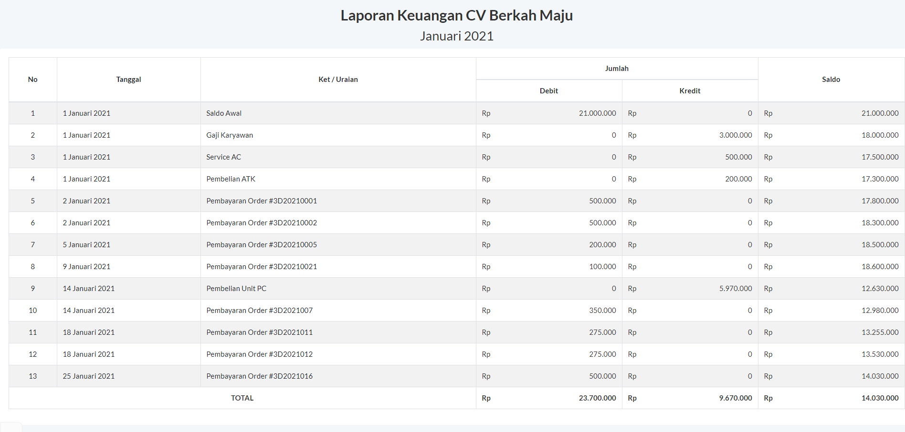

## A Challenge to make simple financial report with ReactJS library

### Welcome! 👋
Thanks for checking out this coding challenge.

**To do this challenge, we need a basic understanding of Javascript and ReactJS.**

## The challenge

The challenge is to build out this financial report and get it looking as close to the design as possible. Please note that we have to use "map" function to calculate the row or column.

#### Built with

- Semantic HTML5 markup
- CSS custom properties
- ReactJS

This project was bootstrapped with [Create React App](https://github.com/facebook/create-react-app).
In the project directory, just run:

### `npm start`

Runs the app in the development mode.\
Open [http://localhost:3000](http://localhost:3000) to view it in the browser.

#### Links

- Solution URL: [Click here to see the source](https://github.com/ayidsudirman/laporan-keuangan-sederhana)
- Live Site URL: [Click here to see live demo](https://ayidsudirman.github.io/laporan-keuangan-sederhana/)
